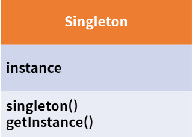
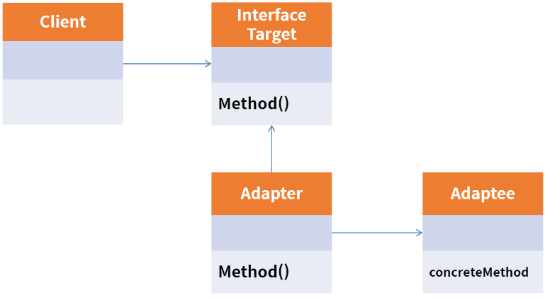
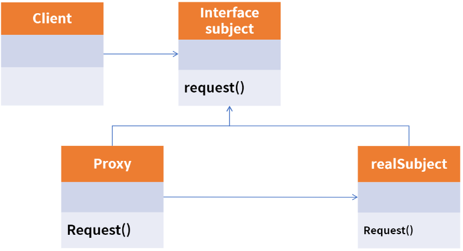
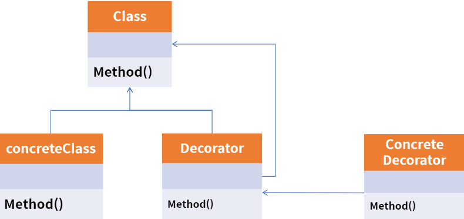
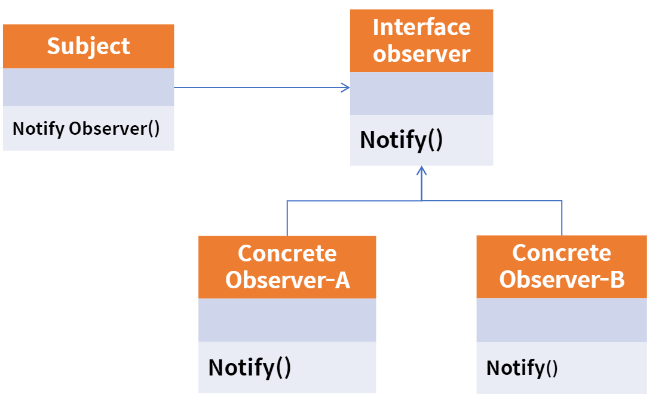
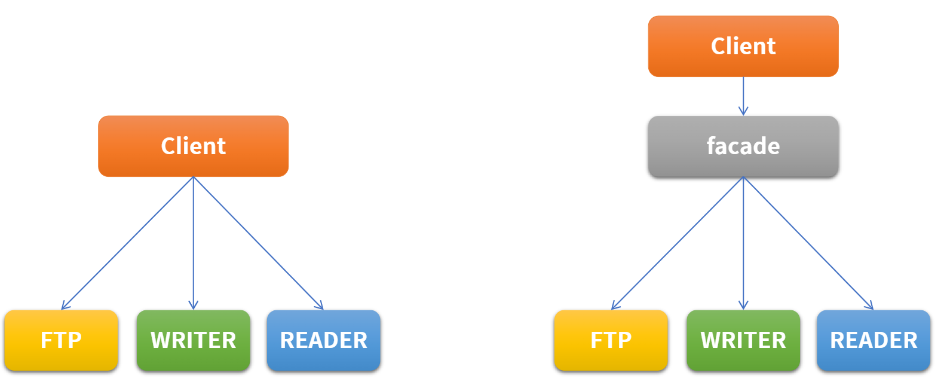
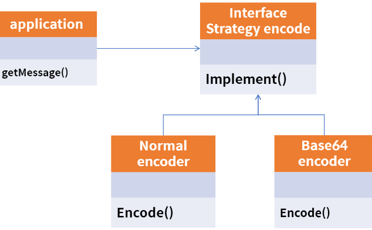

# 디자인 패턴
자주 사용한는 설계 패턴을 정형화해서 이를 유형별로 가장 최적의 방법으로 개발할 수 있도록 정해둔 설게

* Gof 디자인 패턴
  * 소프트웨어를 설게할 때는 기존에 경험이 매우 중요하다. 그러나 모든 사람들이 다양한 경험을 가지고 있을 수는 없다.
  * 이러한 지식을 공유하기 위해 나온 것이 GOF(Gang of Four)의 디자인 패턴이다.
  * 객체 지향 개념에 따른 설계 중 재사용할 경우 유용한 설계를 디자인 패턴으로 정리해 둔 것

* 디자인 패턴의 장점
  * 개발자(설계자) 간의 원활한 소통
  * 소프트웨어 구조 파악 용이
  * 재사용을 통한 개발 시간 단축
  * 설계 변경 요청에 대한 유연한 대처
* 디자인 패턴의 단점
  * 객체지향 설계 / 구현
  * 초기 투자 비용 부담

### 생성 패턴
객체를 생성하는 것과 관련된 패턴, 객체의 생성과 변경이 전체 시스템에 미치는 영향을 최소화하고 코드의 유연성을 높여줌

* 팩토리 메서드 패턴
* 싱글톤 패턴
* 프로토타입 패턴
* 빌드 패턴
* 추상 팩토리 패턴
* 체이닝 패턴

### 구조 패턴
프로그램 내의 자료구조나 인터페이스 구조 등 프로그램 구조를 설계하는데 활용될 수 있는 패턴

클래스, 객체들의 구성을 통해 더 큰 구조를 만들 수 있게 해준다.

큰 규모의 시스템에서는 많은 클래스들이 서로 의존성을 가지게 되는데, 이런 복잡한 구조를 개발하기 쉽게 만들어주고, 유지 보수하기 쉽게 만들어 준다.

* 어댑터 패턴
* 콤포지션 패턴
* 브릿지 패턴
* 데코레이터 패턴
* 파사드 패턴
* 플라이웨이트 패턴
* 프록시 패턴

### 행위 패턴
반복적으로 사용되는 객체들의 상호작용을 패턴화 한 것. 클래스나 객체들이 상호작용하는 방법과 책임을 분사흔 방법을 제공한다.
행위 패턴은 행위 관련 패턴을 사용하여 독립적으로 일을 처리하고자할 때 사용

* 템플릿 메서드 패턴
* 인터프리터 패턴
* 이터레이터 패턴
* 옵저버 패턴
* 전략 패턴
* 비지터(방문자) 패턴
* 책임 연쇄(chain of responsibility) 패턴
* 명령 패턴
* 중재자 패턴
* 상태 패턴
* 메멘토 패턴

### 싱글톤 패턴
* 어떠한 클래스(객체)가 유일하게 1개만 존재할 때 사용
* 이를 주로 사용하는 곳은 서로 자원을 공유할 때 사용
  * ex) 프린터
  * ex) TCP Socket 통신에서 서버와 연결된 connect 객체에 주로 사용

### 어댑터 패턴
* 호환성이 없는 기존 클래스의 인터페이스를 변환하여 재사용할 수 있도록 함
* SOLID 중 개방폐쇄 원칙(OCP)를 따름

### 프록시 패턴
* 프록시(Proxy)는 대리인이라는 뜻으로, 뭔가를 대신해서 처리하는 것.
* Proxy Class를 통해서 대신 전달하는 형태로 설계되며, 실제 클라이언트는 프록시로부터 결과를 받음
* Cache 기능으로도 활용이 가능
* SOLID 중 개방폐쇄 원칙(OCP)과 의존 역전 원칙(DIP)를 따름

### 데코레이터 패턴
* 기존 뼈대 (클래스)는 유지하되, 이후 필요한 형태로 꾸밀 때 사용
* 확장이 필요한 경우 상속의 대안으로도 활용
* SOLID 중 개방폐쇄 원칙(OCP)과 의존 역전 원칙(DIP)를 따름

### 옵저버 패턴
* 관찰자 패턴은 변화가 일어났을 때, 미리 등록된 다른 클래스에 통보해주는 패턴을 구현한 것
* event listener에서 해당 패턴을 사용하고 있음

### 파사드 패턴
* 파사드는 건물의 앞쪽 정면이라는 뜻
* 여러 개의 객체와 실제 사용하는 서브 객체의 사이에 복잡한 의존관계가 있을 시 중간에 facade라는 객체를 두고, 여기서 제공하는 interface만을 활용하여 기능을 확장
* Facade는 자신이 가지고 있는 각 클래스의 기능을 명확히 알아야 함

### 전략 패턴
* 유사한 행위들을 캡슐화하여, 객체의 행위를 바꾸고 싶은 경우 직접 변경하는 것이 아닌 전략만 변경하여, 유연하게 확장하는 패턴
* SOLID 중 개방폐쇄 원칙(OCP)과 의존 역전 원칙(DIP)를 따름 

* 전략 메서드를 가진 전략 객체 -> Normal Strategy, Base64 Strategy
* 전략 객체를 사용하는 컨텍스트 -> Encoder
* 전략 객체를 생성해 컨텍스트에 주입하는 클라이언트