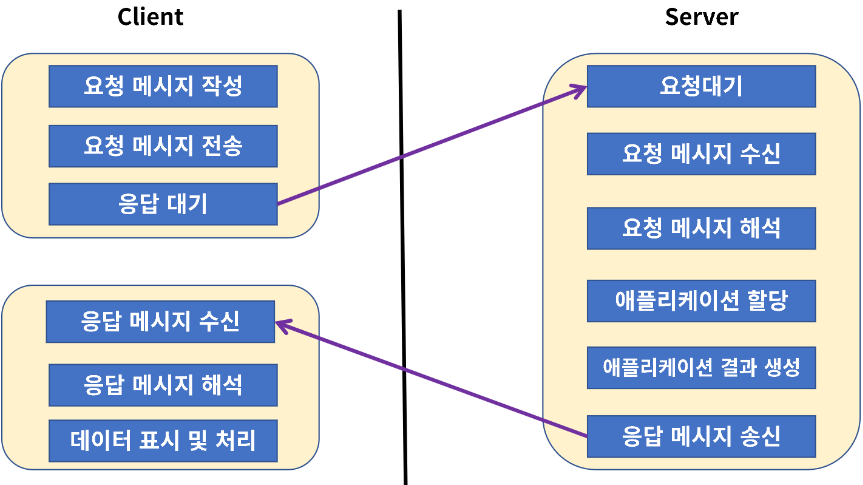
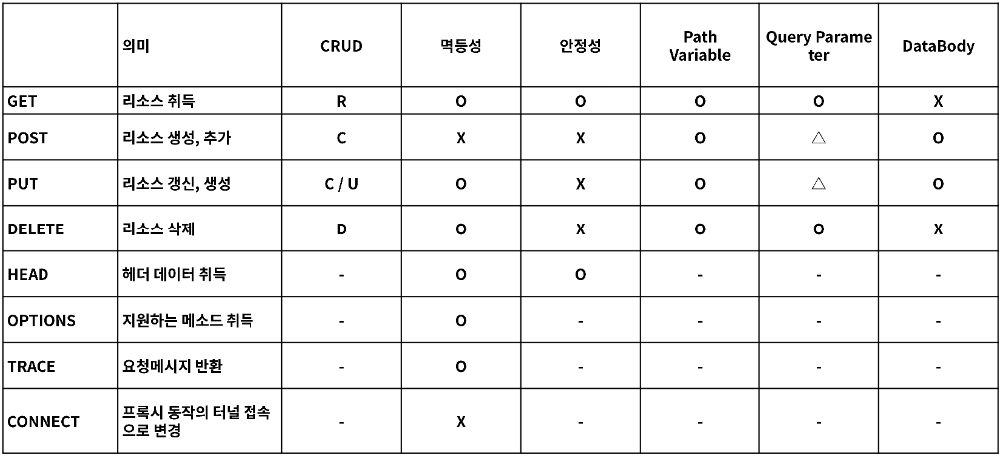
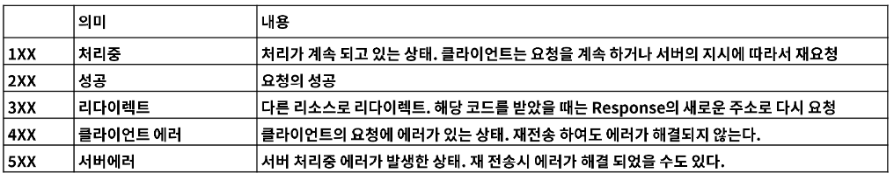
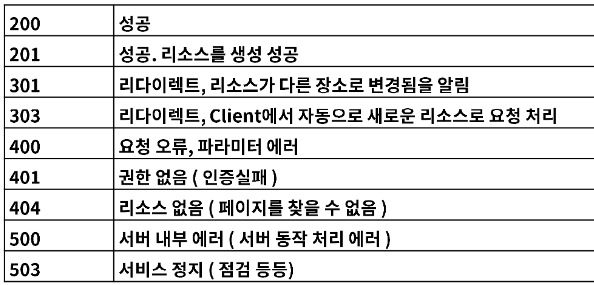
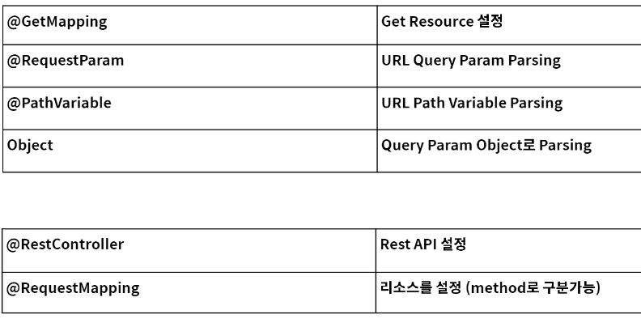
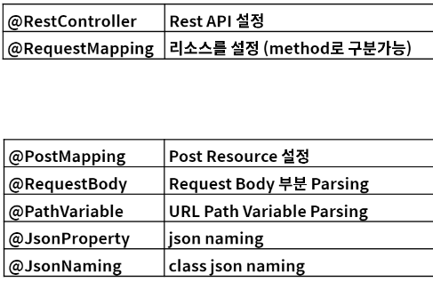
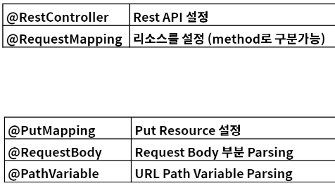
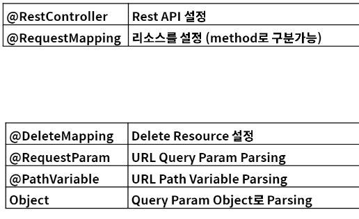
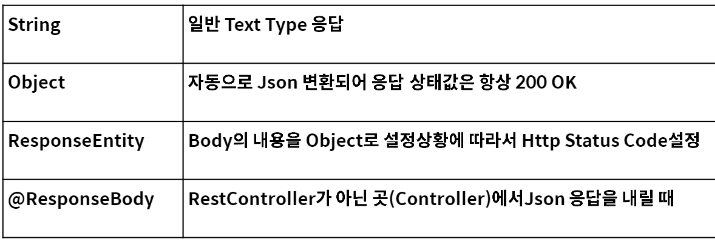

# 웹 개발

### Web 이란
* (World Wide Web, WWW, W3)은 인터넷에 연결된 컴퓨터를 통해 사람들이 정보를 공유할 수 있는 전 세계적인 정보 공간을 말함
* Web Site
  * google, naver, daum, facebook 등 HTML로 구성된 여러 사이트
* API (Application Programming Interface) * Web Service
  * Kakao Open API, Google Open API, Naver Open API 등
* User Interface
  * Chrome, Safari, Explorer, Smart Watch, IP TV 등

---

* HTTP - Hypertext Transfer Protocol
  * 어플리케이션 컨트롤
  * GET, POST, PUT, DELETE, OPTIONS, HEAD, TRACE, CONNECT

* URI - Uniform Resource Identifier
  * 리소스 식별자
  * ex) 특정 사이트, 특정 쇼핑 목록, 동영상 목록 등
  * 모든 정보에 접근할 수 있는 정보

* HTML - Hypertext Markup Language
  * 하이퍼미디어 포맷
  * XML을 바탕으로 한 범용 문서 포맷
  * 이를 이용하여 Chrome, Safari, Explorer에서 사용자가 알아보기 쉬운 형태로 표현

### REST
* REST(Representational State Transfer: 자원의 상태 전달) - 네트워크 아키텍처
1. Client, Server: 클라이언트와 서버가 서로 독립적으로 분리
2. Stateless: 요청에 대해 클라이언트이 상태를 서버에 저장하지 않음
3. Cache: 클라이언트는 서버의 응답을 Cache(임시 저장)할 수 있어야 함
4. 계층화(Layerd System): 서버와 클라이언트 사이에 방화벽, 게이트웨이, Proxy 등 다양한 계층 형태로 구성이 가능해야 하며, 이를 확장할 수 있어야 함
5. 인터페이스 일관성: 인터페이스의 일관성을 지키고, 아키텍처를 단순화시켜 작은 단위로 분리하여, 클라이언트와 서버가 독립적으로 개선될 수 있어야 함
6. Code on Demand (Optional): 자바 애플릿, 자바스크립트, 플래시 등 특정한 기능을 서버로부터 클라이언트가 전달받아 코드를 실행할 수 있어야 함

#### 다음의 인터페이스 일관성을 잘 지켰는지에 따라, REST를 잘 사용했는지 판단할 수 있음

1. 자원의 식별
   * 웹 기반의 REST에서는 리소스 접근을 할 때 URI를 사용
   * ex) https://ex.co.kr/user/100
   * Resource: user
   * 식별자: 100

2. 메시지를 통한 리소스 조작
   * Web 에서의 데이터 전달 방식: HTML, XML, JSON, TEXT 등
   * 어떠한 타입의 데이터인지 알려주기 위해 HTTP Header 부분에 content-type을 통해 데이터 타입을 지정
   * 리소스 조작을 위해 데이터 전체를 전달하지 않고, 이를 메시지로 전달
   * ex) 
     * 서버의 user 라는 정보의 전화번호를 처음에는 number 라고 결정.
     * 이 정보를 Client와 주고 받을 때 그대로(number) 사용하고 있었다면, 
     * 이후 서버의 resource 변경으로 phone_number로 바뀌게 되면
     * Client는 이를 처리하지 못하고 에러 발생함
   * 위와 같은 부분을 방지하기 위해 별도의 메시지 형태로 데이터를 주고 받으며, client-server가 독립적으로 확장가능하도록 해야 함

3. 자기서술적 메시지
   * 요청하는 데이터가 어떻게 처리되어져야 하는지 충분한 데이터를 포함할 수 있어야 함
   * HTTP 기반의 REST에서는 HTTP Method와 Header 정보, 그리고 URI의 포함되는 정보로 표현할 수 있어야 함
   * ex)
     * GET: https://ex.co.kr/user/100, 사용자 정보 요청
     * POST: https://ex.co.kr/user, 사용자 정보 생성
     * PUT: https://ex.co.kr/user, 사용자 정보 생성 및 수정
     * DELETE: https://ex.co.kr/user/100, 사용자 정보 삭제
     * 그 외 담지 못하는 정보들은 URI 메시지를 통해 표현

4. Application 상태에 대한 엔진으로써 하이퍼미디어
    * REST API를 개발할 때 단순히 Client 요청에 대한 데이터만 응답해주는 것이 아닌 
    * 관련된 리소스에 대한 Link 정보까지 같이 포함되어져야 함

이러한 조건들을 잘 갖춘 경우 REST Ful 하다 표현하고, 이를 REST API라고 부름

### URI 설계 패턴
1. URI (Uniform Resource Identifier)
   * 인터넷에서 특정 자원을 나타내는 주소값. 해당 값은 유일 (응답을 달라질 수 있음)
   * 요청: https://ex.co.kr/resource/sample/1
   * 응답: example.pdf, example.pdf.doc
2. URL (Uniform Resource Locator)
   * 인터넷 상에서의 자원, 특정 파일이 어디에 위치하는지 식별하는 주소
   * 요청: https://ex.co.kr/example.pdf
   * URL은 URI의 하위 개념

#### URI 설계 원칙(RFC-3986)
* 슬래시 구분자(/)는 계층 관계를 나타내는 데 사용
* URI 마지막 문자로 / 를 포함하지 않음
* 하이픈(-)은 URI 가독성을 높이는 데 사용
* 밑줄(_)은 사용하지 않음
* URI 경로에는 소문자를 사용
* 파일 확장자는 URI에 포함하지 않음
* 프로그래밍 언어에 의존적인 확장자를 사용하지 않음
* 구현에 의존적인 경로를 사용하지 않음 (ex, servlet)
* 세션 ID를 포함하지 않음
* 프로그래밍 언어의 Method 명을 이용하지 않음
* 명사에 단수형보다는 복수형 사용. 컬렉션에 대한 표현은 복수로 사용
* 컨트롤러 이름으로는 동사나 동사구를 사용
* 경로 부분 중 변하는 부분은 유일한 값으로 대체
* CRUD 기능을 나타내는 것은 URI에 사용하지 않음
* URI Query Parameter 디자인
  * URI 쿼리 부분으로 컬렉션 결과에 대해 필터링할 수 있다
* URI 쿼리는 컬렉션의 결과를 페이지로 구분하여 나타내는 데 사용
* API에 있어 서브 도메인은 일관성 있게 사용
* 클라이언트 개발자 포탈 서브 도메인은 일관성 있게 만듬

### HTTP Protocol
* HTTP로 RFC 2616에서 규정된 Web에서 데이터를 주고 받는 프로토콜
* 하이퍼 텍스트 전송용 프로토콜로 정의되어 있지만 실제로는 HTML, XML, JSON, Image, Voice, Video, Javascript, PDF 등  다양한 컴퓨터에서 다룰 수 있는 것은 모두 전송 가능
* HTTP는 TCP를 기반으로 한 REST의 특징을 모두 구현하고 있는 Web 기반의 프로토콜
* HTTP는 메지시를 주고 (Request) 받는 (Response) 형태의 통신 방법

    

* HTTP 요청을 특정하는 Method

    

* HTTP 응답의 상태를 나타내는 코드

    

* 자주 사용되는 상태 코드
    
    

### Spring boot API
* GET API

    

* POST API

    

* PUT API

    

* DELETE API

    

* RESPONSE

    