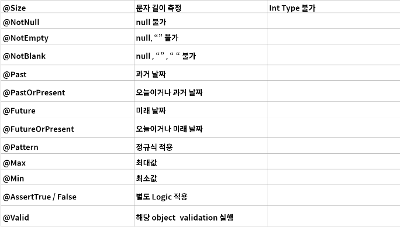
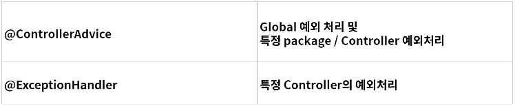
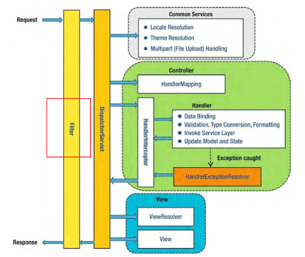
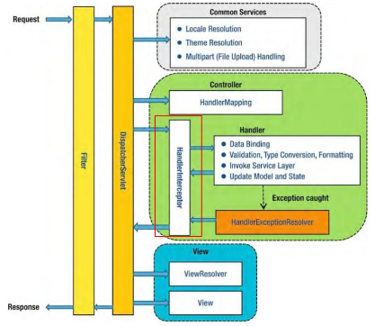

# Validation

* gradle dependencies
  implementation("org.springframework.boor:spring-boot-starter-validation")

* Custom Validation
    * AssertTrue/False와 같은 메서드 지정을 통해 Custom Logic 적용 가능
    * ConstraintValidator를 적용하여 재사용 가능한 Custom Logic 적용 가능

# Exception 처리
Web Application의 입장에서 에러가 났을 때 내려줄 수 있는 방법은 많지 않음
1. 에러페이지
2. 4XX Error or 5XX Error
3. Client가 200 외에 처리를 하지 못할때는 200을 내려주고 별도의 에러 Message 전달

# Filter

Filter란 Web Application에서 관리되는 영역으로써 Spring Boot Framework에서 Client로부터
오는 요청/응답에 대해서 최초/최조 단계의 위치에 존재하며, 이를 통해 요청/응답의 정보를 변경하거나,
Spring에 의해서 데이터가 변환되기 전의 순수한 Client의 요청/응답 값을 확인할 수 있다.

유일하게 ServletRequest, ServletResponse의 객체를 변환할 수 있음

주로 Spring Framework에서는 request/response의 Logging 용도로 활용하거나, 인증과 관련된 로직들을 해당 Filter에서 처리

이를 선/후 처리함으로써 Service Business Logic과 분리시킨다.

# Interceptor

Interceptor란 Filter와 매우 유사한 형태지만, 차이점으로는 Spring Context에 등록됨.

AOP와 유사한 기능을 제공할 수 있으며, 주로 인증 단계를 처리하거나 Logging 하는 데 사용

이를 선/후 처리함으로써, Service Business Logic과 분리시킨다.

