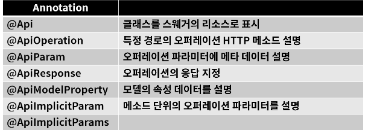

# Swagger

* 개발한 REST API를 편리하게 문서화
* 이를 통해 관리 및 제 3의 사용자가 편리하게 API를 호출해보고 테스트할수 있는 프로젝트
* spring boot에서는 간단하게 springfox-boot-starter를 gradle dependencies에 추가함으로써 사용 가능
* 주의할 점: 운영환경과 같은 오부에 노출되면 안되는 곳에 사용할 때 주의

